# KON-NECT — System Diagrams

A complete visual breakdown of how every part of KON-NECT works. Written in plain language so anyone can follow along.

---

## 1. The Big Picture

How every part of KON-NECT connects — your device, the brain behind the scenes, and external services.

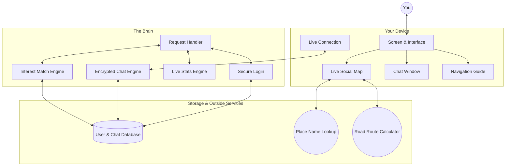

---

## 2. How Data Is Organized

The structure of every piece of information stored in KON-NECT.

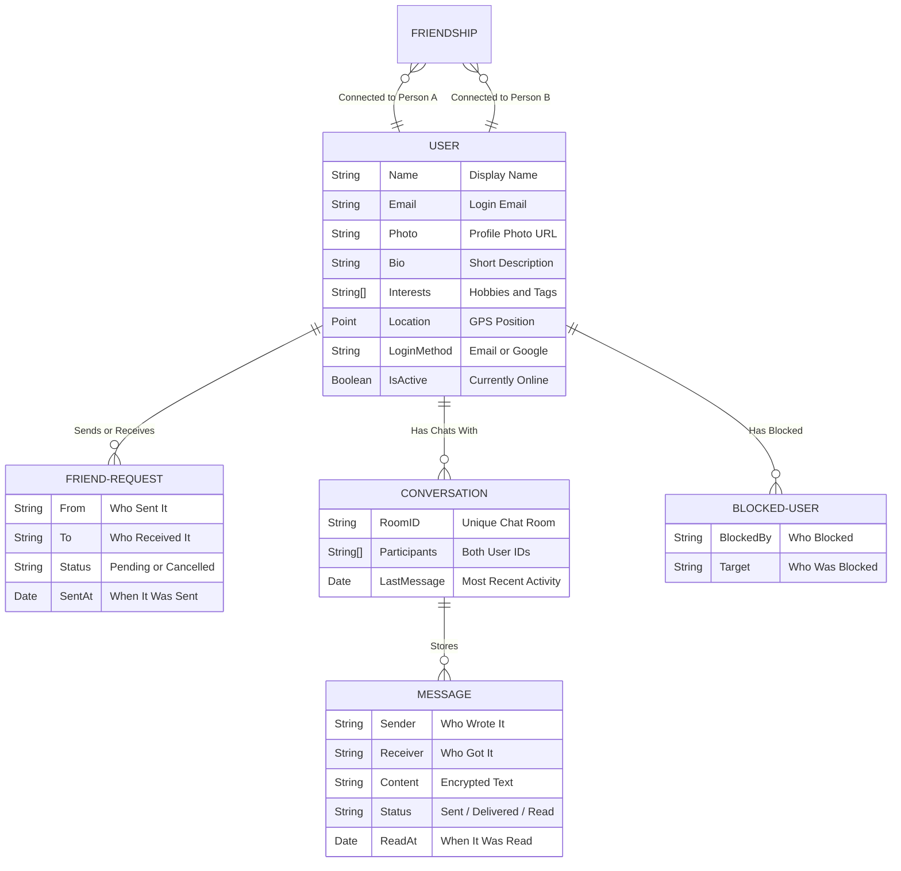

---

## 3. Signing In

How you securely log in, whether using email or Google.

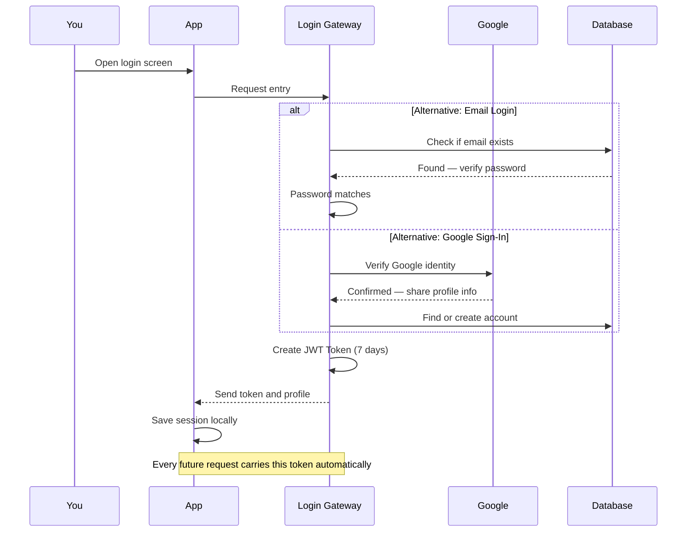

---

## 4. Compatibility Matching

How the app decides which people near you are a good match.

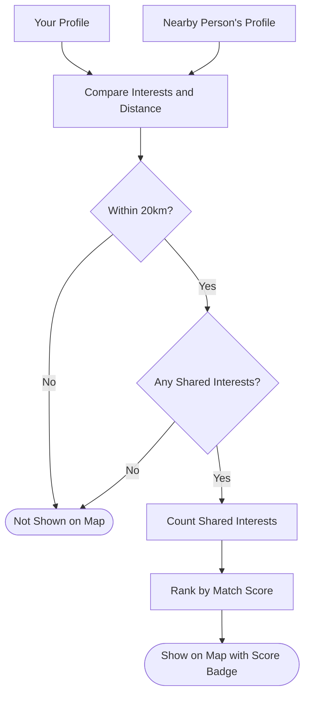

---

## 5. People Discovery Flow

How the Connect tab and map find and sort people for you.

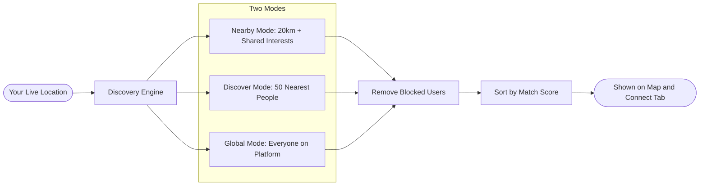

---

## 6. Connecting with Someone

The full lifecycle of a friend connection — from request to friendship to removal.

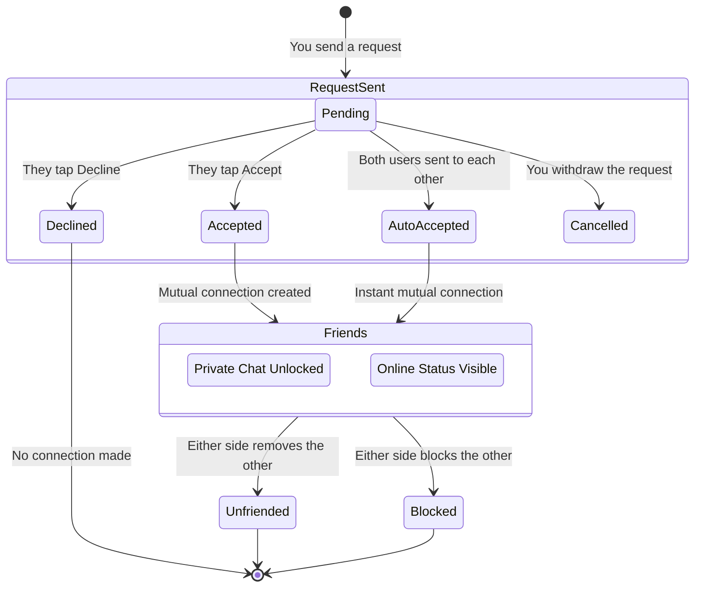

---

## 7. Encrypted Chat Flow

How your messages travel securely and are stored with read receipts.

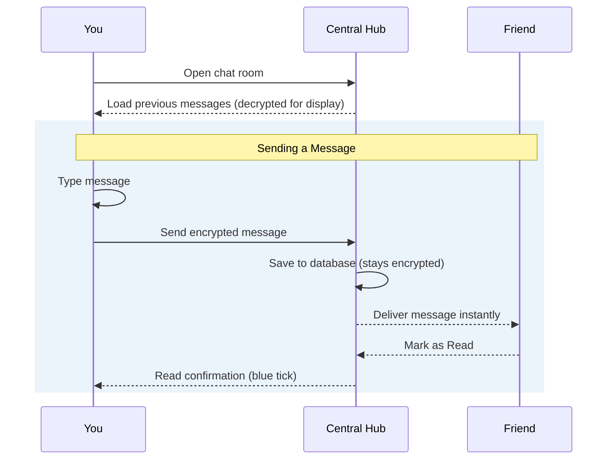

---

## 8. Live Location & Map Updates

How your position is tracked and the map stays accurate without draining your battery.

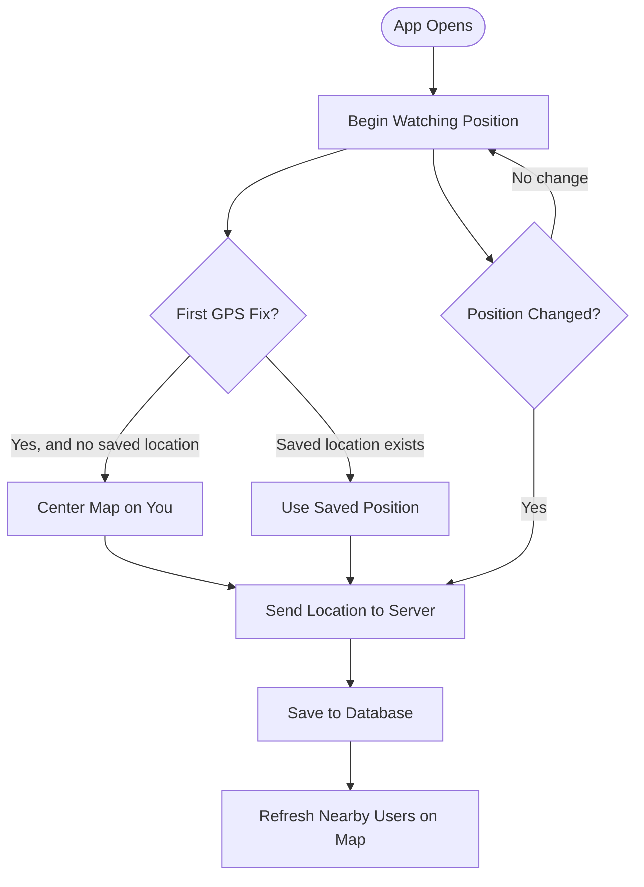

---

## 9. Navigation & Route Tailing

How turn-by-turn directions work and how the route shrinks as you move.

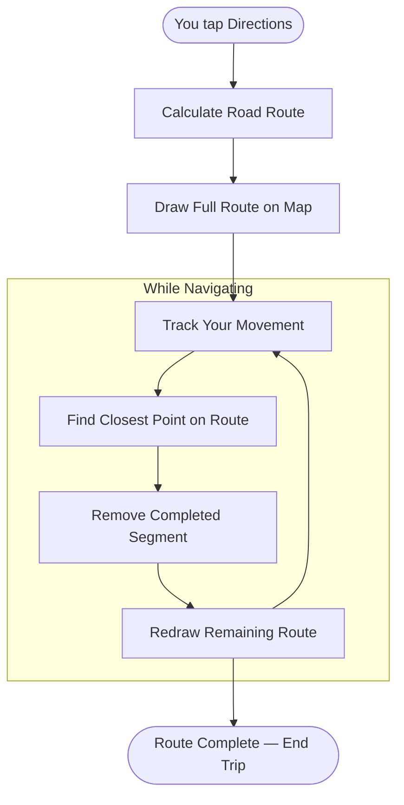

---

## 10. Interest Normalization

How custom interest tags are cleaned up and kept consistent across all users.

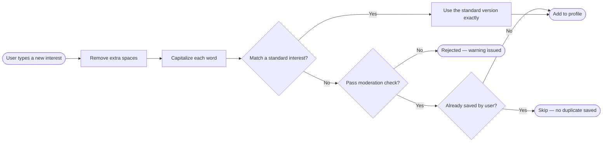

---

## 11. Blocking & Safety

How blocking works instantly across the entire platform.

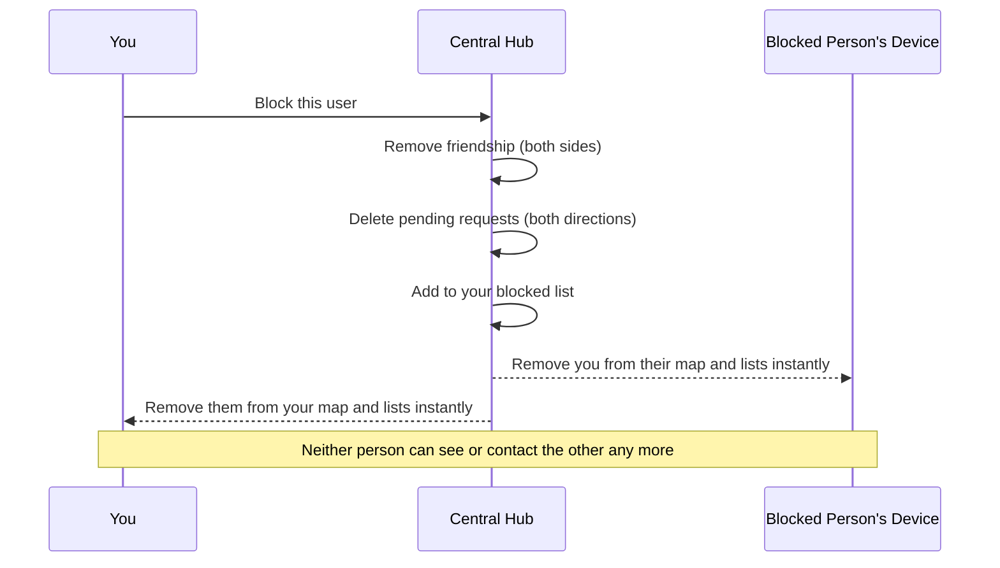

---

## 12. Content Moderation

How inappropriate interest tags are caught automatically.

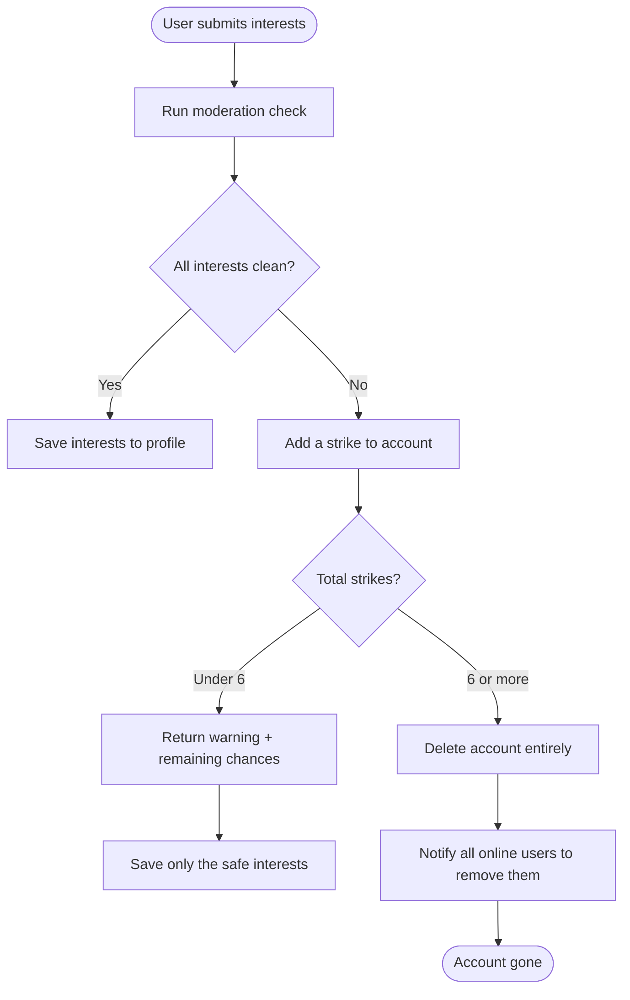

---

## 13. Live Online Status

How KON-NECT knows who is online and keeps status badges accurate.

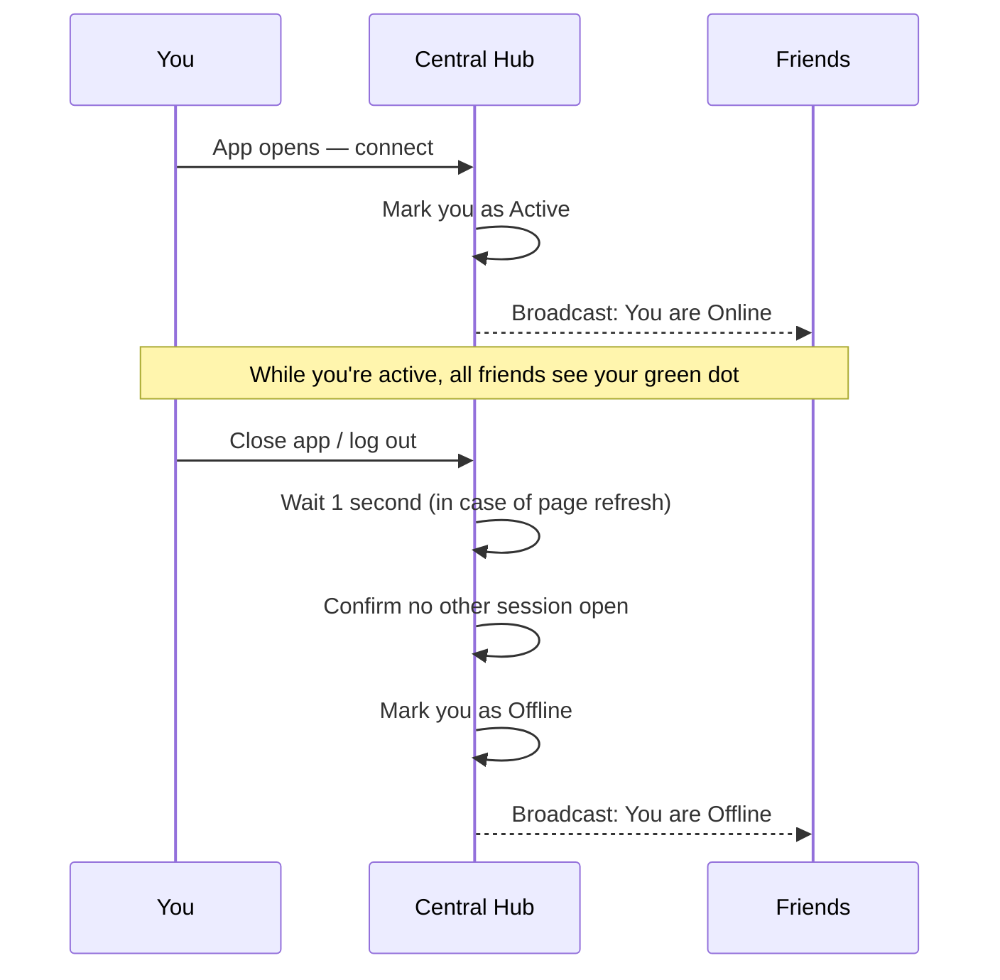

---

## 14. Dashboard Stats

How the live numbers on your home screen are calculated.

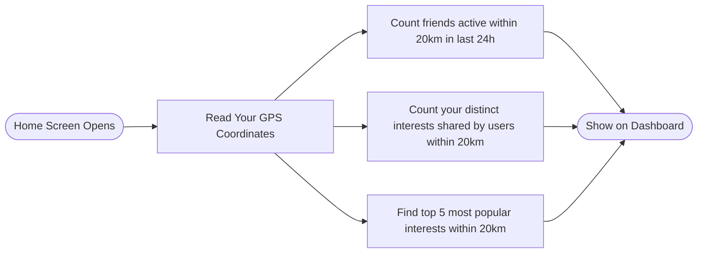
